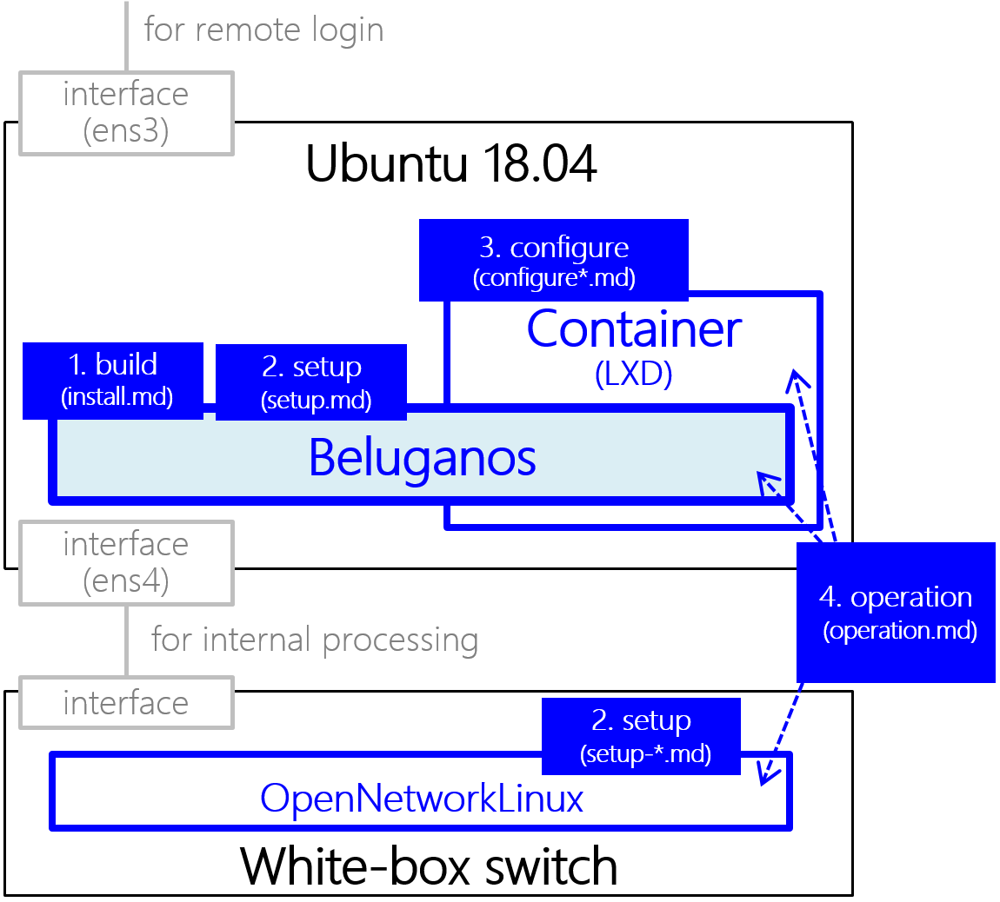

# Beluganos
Beluganos is a **new network OS** designed for **white-box switches** (OF-DPA), which can apply large-scale networks.

- IP Routing (BGP, OSPF, ...)
- **IP/MPLS**, BGP/MPLS IP-VPNs
- **Interoperability** with conventional IP or IP/MPLS router
- ASIC based **full hardware processing**

The feature matrix of Beluganos is available at [doc/function.md](doc/function.md).

## Architecture
Beluganos has one or more [Linux containers](https://linuxcontainers.org/). The route table which is installed to Linux containers is copied to white-box switches. To configure router settings like IP addresses or parameter of routing protocols, you have to configure the settings of Linux containers.

For more details, please check [doc/architecture.md](doc/architecture.md).

## Getting Started

### 1. Install

#### 1.1. Pre-requirements
You can also build Beluganos in the white-box switches, but installing another Ubuntu server is recommended at first.

- Ubuntu server
	- **Ubuntu 16.04 server** is strongly recommended.
	- **Two or more network interfaces** are required.
- White-box switches
	- **[OF-DPA 2.0](https://github.com/Broadcom-Switch/of-dpa/) switch** and OpenFlow agent are required.
	- If you don't have OF-DPA switches, any OpenFlow1.3 switches are acceptable to try Beluganos. In this case, we recommend [Lagopus switch](http://www.lagopus.org/).

#### 1.2. Build
~~~~
$ cd ~
$ git clone https://github.com/beluganos/beluganos/ && cd beluganos/
$ vi create.ini
  FFLOW_MNG_IFACE=ens3             # Set your management interface name for remote login
  FFLOW_OFC_IFACE=ens4             # Set your secure channel interface name connected to switches
  FFLOW_OFC_ADDR=172.16.0.55       # (Optional) You can change FFLOW_OFC_IFACE's IP address if needed
  FFLOW_OFC_MASK=255.255.255.0     # (Optional) You can change FFLOW_OFC_IFACE's subnet mask if needed

$ ./create.sh
~~~~

**For proxy environment only:** If you need to use proxy server to connect Internet, please add proxy settings to `create.ini` before execute `./create.sh`.

~~~~
$ vi create.ini
  PROXY=http://<server-ip>:<server-port>
~~~~

### 2. Quick start
In order to try Beluganos quickly, **some example cases are prepared**. This example can configure automatically not only Beluganos but also other routers to connect with Beluganos. If you wish to use this, please refer to [doc/example/case1/case1.md](doc/example/case1/case1.md) instead of the following description.

### 3. Setup

Before starting setup and operation, please execute `setenv.sh` script to set your environments properly. After executing this script, the strings of "`(mypython)`" will be appeared in your console. Because these settings will be cleared after logout, you should execute this script every login.

 ~~~~
 $ . ./setenv.sh
 ~~~~

#### 3.1. Settings for switches
To set up Beluganos step by step, settings for switches and Linux containers are required. At first, you should set the type of your white-box switch as follows:

~~~~
$ vi etc/playbooks/roles/dpath/files/sample_sw/fibc.yml
 datapaths:
   - name: sample_sw            # your switch name
     dp_id: <dp-id>             # datapath-id
     mode: <switch-type>        # ofdpa2 or generic
~~~~

The value of `<dp-id>` means OpenFlow datapath ID of your switch. The value of `<switch-type>` should be edited to match your switch type, and currently `ofdpa2`, `generic`, `ovs` are supported. 

- `ofdpa2`:  for OF-DPA white-box switches
- `generic`: for OpenFlow switches like lagopus
- `ovs`: for OpenvSwitch (limited support)

These settings can be loaded by `etc/playbooks/dp-sample.yml`.

~~~~
$ ansible-playbook -i etc/playbooks/hosts -K etc/playbooks/dp-sample.yml
~~~~

#### 3.2. Settings for containers
**The settings of Linux containers are corresponding router configurations**, like IP addresses or routing options. The general settings can be configured by ansible. At the first time to set up Beluganos, default settings described as follows are recommended:

- Inventory
	- Sample: `etc/playbooks/hosts`
	- In this file, [lxd-sample] set to "sample". **"sample" should match with the container name** which is determined by task file name.
- Playbook
	- Sample: `etc/playbooks/lxd-sample.yml`
	- In this file, the task related with lxd-sample is defined.
- Task
	- Sample: `etc/playbooks/roles/lxd/tasks/sample.yml`
	- **The file name will be a container name.** In this sample, the container name is "sample".
	- In sample file, eth1 and eth2 are assigned to D-Plane port. Because eth0 will be assigned for internal use, **do NOT edit eth0 settings**.

In above settings, the files where is in `etc/playbooks/lxd/files/sample/` will be used to set up. After checking these files, please execute playbook:

~~~~
$ ansible-playbook -i etc/playbooks/hosts -K etc/playbooks/lxd-sample.yml && lxc stop sample
~~~~

Note that this section describes about only sample settings. Of course, you can configure router options as you like. For more details, please refer to [doc/setup-guide.md](doc/setup-guide.md).

### 4. Run

After building Beluganos and setup containers, let's start Beluganos! Beluganos will work properly by following command.

~~~~
$ beluganos.py run
~~~~

And then, open another terminal and execute following:

~~~~
$ beluganos.py add sample
~~~~

Note that "sample" is the container name. After that, you can confirm the behavior of Beluganos if you want. For example, to check route information, you can use `show ip route` command in FRRouting's console.

~~~~
$ beluganos.py con sample
root@sample:~# vtysh -c "show ip route"
Codes: K - kernel route, C - connected, S - static, R - RIP,
       O - OSPF, I - IS-IS, B - BGP, P - PIM, N - NHRP, T - Table,
       v - VNC, V - VNC-Direct,
       > - selected route, * - FIB route

K>* 0.0.0.0/0 via 192.169.1.1, eth0
O   10.0.1.6/32 [110/0] is directly connected, lo, 00:08:06
C>* 10.0.1.6/32 is directly connected, lo
O   10.10.1.4/30 [110/100] is directly connected, eth1, 00:08:06
C>* 10.10.1.4/30 is directly connected, eth1
O   10.10.2.4/30 [110/200] is directly connected, eth2.100, 00:08:06
C>* 10.10.2.4/30 is directly connected, eth2.100
~~~~

For more details of operating Beluganos, please refer to [doc/operaion-guide.md](doc/operaion-guide.md).

## Support
Github issue page and e-mail are available. If you prefer to use e-mail, please contact `msf-contact [at] lab.ntt.co.jp`.

## Development & Contribution
Any contribution is encouraged. The main component is written in Go and Python. If you wish to create pull-request on github.com, please kindly create your request for **develop branch**, not master branch. If you find any issue, please kindly notify us by github issue pages.

For more details, please refer to [CONTRIBUTING.md](CONTRIBUTING.md).

## License
Beluganos is licensed under the **Apache 2.0** license. See [LICENSE](LICENSE).

## Project
This project is a part of [Multi-Service Fabric](https://github.com/multi-service-fabric/msf).

