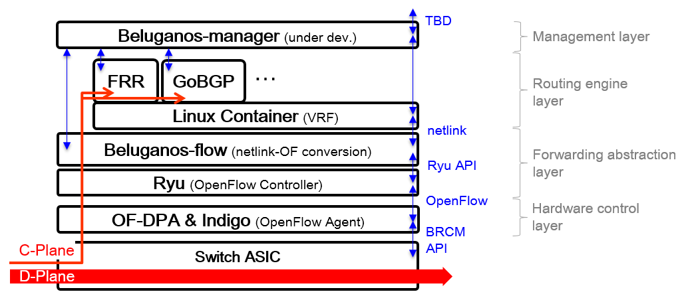
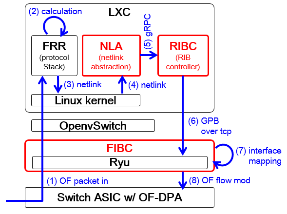

# Architecture

Beluganos consists of some layer. The routing engine layer create routing information base (RIB), and hardware control layer may install forwarding information base (FIB) to hardware. The forwarding abstraction layer which converts from RIB to FIB is the main component of Beluganos.

## Routing engine layer

Routing engine layer creates RIB by routing protocols. This layer is placed on [Linux container](https://linuxcontainers.org/). In this layer, you can use any routing protocols as you like. The applicable requirement for the software of routing protocols is that best paths will be installed correctly to Linux kernel, because Beluganos get the path information from netlink and install to white-box switches.

Beluganos does NOT contain any routing protocol stack. In verification, [FRRouting](https://frrouting.org/) or [GoBGP](https://osrg.github.io/gobgp/) is used. If you use simple setup script to build Beluganos, both FRRouting and GoBGP will be installed. Please note that currently only GoBGP will be supported as MP-BGP stack which deals with vpnv4 route in MPLS-VPN case.

## Hardware control layer

Hardware control layer means ASIC control functions. In Beluganos, [OF-DPA](https://www.broadcom.com/products/ethernet-connectivity/software/of-dpa) supported switch is assumed. OF-DPA provides open access for ASIC, including wire-rate packet forwarding, TCAM based longest match, and MPLS functions.

Moreover, because OF-DPA is compliant with [OpenFlow](https://www.opennetworking.org/sdn-resources/openflow)1.3, any OpenFlow switches may be applied for Beluganos's data-plane if you want. If you don't have white-box switches hardware yet, [Lagopus](http://www.lagopus.org/) is recommended for verifying Beluganos. Lagopus is one of the most compatible switches for OpenFlow 1.3.

## Forwarding abstraction layer

Forwarding abstraction layer convert path information. This layer has three important components: NLA, RIBC, FIBC.

NLA (NetLink Abstraction) is the parser of [netlink](https://tools.ietf.org/html/rfc3549). In Beluganos's architecture, kernel's path information is the original data for RIB. The main function of NLA is getting path information from linux kernel.

RIBC (Routing Information Base Controller) and FIBC (Forwarding Information Base Controller) create OpenFlow entry from path information. The main role of RIBC is creating base information for each OpenFlow table. Since OF-DPA support OpenFlow Table Type Pattern (TTP), RIBC will send message which is separated into units of OpenFlow TTP. Yet in FIBC, creating OpenFlow entry and converting IF name to hardware are the main efforts. [Ryu](https://osrg.github.io/ryu/) is used as OpenFlow controller. Therefore, FIBC is just Ryu app.

The reason why RIBC and FIBC are separated is to support MPLS-VPN. In MPLS-VPN case, multiple linux container will be launched as multiple VRF, and multiple RIBC will send message to single FIBC. Note that RIBS (RIB sync) process will be worked to redistribute route information in MPLS-VPN case.

## Management layer

The management function will be required for network OS. NETCONF is already available at [https://github.com/beluganos/netconf](https://github.com/beluganos/netconf). [ansible](configure-ansible.md) is also available for setup. SNMP, syslog, CLI function is under developing now.