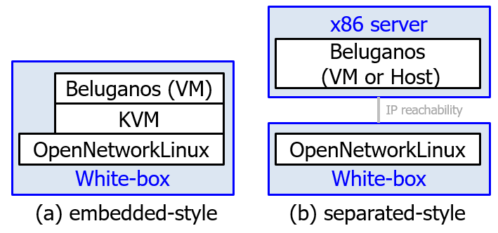

# Install guide
This document shows how to install Beluganos in your systems. If you want to try Beluganos, reading this page at first is recommended.

## Pre-requirements

### Choose deploy style



Beluganos supports both **embedded-style** and **separated-style**. Please select each style.

1. embedded-style
   - Beluganos will be deployed into the white-box switches, like conventional router.
	- Generally, the virtual machine (KVM) on x86 server is required for installation, even if you prefer to select embedded-style. In this case, after installation, you may move the VM image (.qcow2) from x86 server to white-box switches.
	- Building ONL is required to select embedded-style. Because this procedure is some complicated, choosing **separated-style is recommended** if it is the first time for you to try Beluganos.

2. separated-style
   - Beluganos will be deployed at separated x86 server.
	- The physical or virtual machine is required. Please connect with separated server and the outbound port directly.

### Resources

1. Server
	- Software requirements:
		- **Ubuntu 18.04** (18.04-live-server-amd64).
		- If you use Ubuntu 18.04.1 or later, additional settings are required before proceed. Please check [Appendix A](#appendix-a-additional settings-at-ubuntu18041-or-later) of this document.
	- Network requirements:
		- embedded-style: **One or more network interfaces** are required.
		- separated-style: **Two or more network interfaces** are required.
	- Storage requirements:
		- Some LXC instance will be created. More than **12GB HDD** is recommended.
		- If you have a plan to use multiple VRF, more HDD is required.
1. White-box switches
	- To use OpenNSL mode, **[OpenNSL 3.5](https://github.com/Broadcom-Switch/OpenNSL) supported switch** is required. OpenNSL agent is included in this repository. OpenNSL application in Edge-core switches is also available at [Edge-core's blog](https://support.edge-core.com/hc/en-us/sections/360002115754-OpenNSL).
	- To use OF-DPA mode, **[OF-DPA 2.0](https://github.com/Broadcom-Switch/of-dpa/) supported switch** and OpenFlow agent are required. OF-DPA application in Edge-core switches is also available at [Edge-core's repository](https://github.com/edge-core/beluganos-forwarding-app).
	- If you don't have real switches, any OpenFlow 1.3 switches are acceptable to try Beluganos. In this case, [Lagopus switch](http://www.lagopus.org/) is recommended.

## 1. Build
Using shell scripts (`create.sh`) is prepared for building Beluganos. Before starting scripts, setting file (`create.ini`) should be edited for your environments. Note that the internet access is required.

```
$ cd ~
$ git clone https://github.com/beluganos/beluganos/ && cd beluganos/
$ vi create.ini

  #
  # Proxy
  #
  # PROXY=http://<ip>:<port>       # (Optional) Comment out if you need proxy server.

  #
  # Host
  #
  BELUG_OFC_IFACE=ens4             # Set interface name connected to OpenNetworkLinux (embedded-style) or white-box switches (separated-style).
  BELUG_OFC_ADDR=172.16.0.55/24    # (Optional) Specify BELUG_OFC_IFACE's IP address and prefix-length if needed.

$ ./create.sh
```

This script may take several minutes. The message 

```
Finished processing dependencies for fibc==...
```

indicates that all installation is successfully finished.

## 2. Register as a service

Generally, registering Beluganos's main module as a Linux service is recommended.

```
$ cd ~/beluganos
$ make install-service
```

If you will use NETCONF to configure beluganos, following steps are also required.

```
$ cd ~/netconf
$ sudo make install-service
```

## Next steps

You may choose two options.

### Quick start by example
If you want to try our example cases like [case 1 (IP/MPLS router)](example/case1/case1.md) or [case 2 (MPLS-VPN PE router)](example/case2/case2.md), please get back the example documentations.

### Step-by-step procedure
You should register your white-box switches (or OpenFlow switches) to Beluganos's main module. Please refer [setup.md](setup.md) for more details.


---

## Appendix
### Appendix A. Additional settings at Ubuntu18.04.1 or later

In Ubuntu18.04.01 or later, some settings of apt source are removed. In this case, additional apt source is required to install Beluganos.

```
$ sudo vi /etc/apt/sources.list.d/beluganos.list

deb http://archive.ubuntu.com/ubuntu/ bionic universe
deb http://archive.ubuntu.com/ubuntu/ bionic-updates universe
deb http://archive.ubuntu.com/ubuntu/ bionic multiverse
deb http://archive.ubuntu.com/ubuntu/ bionic-updates multiverse
deb http://security.ubuntu.com/ubuntu bionic-security universe
deb http://security.ubuntu.com/ubuntu bionic-security multiverse

$ sudo apt update
```

### Appendix B. Change the connection settings of white-box switches after installation

If you want to change the white-box switch's settings which specify `BELUG_OFC_IFACE` or `BELUG_OFC_ADDR` at `create.ini` after installation, you can use netplan.

```
$ sudoedit /etc/netplan/02-beluganos.yaml

# -*- coding: utf-8 -*-
network:
  version: 2
  renderer: networkd
  ethernets:
    ens4:                 ## <= You can change device name
      addresses:
        - 172.16.0.55/24  ## <= You can change IP address

```

After editing, to reflect settings, please reboot OS or issue apply command.

```
$ sudo netplan apply
```

### Appendix C. Change the building settings (`create.ini`)

The settings of `create.sh` describes at `create.ini`. If you change following settings, please re-execute `create.sh` again.

#### virtualenv

If you want to use "virtualenv" because of the restriction of your host, you may comment out `ENABLE_VIRTUALENV`.

```
#
# Host
#
BELUG_OFC_IFACE=ens4
BELUG_OFC_ADDR=172.16.0.55/24
# ENABLE_VIRTUALENV=yes
```

#### NETCONF

`create.sh` will deploy also beluganos/netconf modules automatically. This may take some minutes to deploy. If you don't have a plan about using NETCONF, you can disable this.

```
#
# Netconf
#
BEL_NC_ENABLE=yes
BEL_NC_URL=https://github.com/beluganos/netconf
```

- `BEL_NC_ENABLE`: Whether to enable NETCONF support. "yes" or "no".
- `BEL_NC_URL`: DO NOT EDIT.

#### OpenNSL

```
#
# OpenNSL
#
BEL_ONSL_ENABLE=yes
BEL_ONSL_PLATFORM=as7712
BEL_ONSL_PKG="github.com/beluganos/go-opennsl"
```

- `BEL_ONSL_ENABLE`: Whether to enable OpenNSL support. "yes" or "no".
- `BEL_ONSL_PLATFORM`: OpenNSL supported platform name (as5712, as7712, ...). The platform name is shown at the **directory name** of [Broadcom's repository](https://github.com/Broadcom-Switch/OpenNSL/tree/master/bin). If you will use the .deb package which is provided by switch vendor, you have not to care this parameter.
- `BEL_ONSL_PKG`: The URL which is Beluganos's OpenNSL library. DO NOT EDIT.

If you want to change this configuration after installation, please issue only following:

```
$ cd ~/beluganos
$ ./create.sh opennsl
```

#### other

We don't recommend to change.
